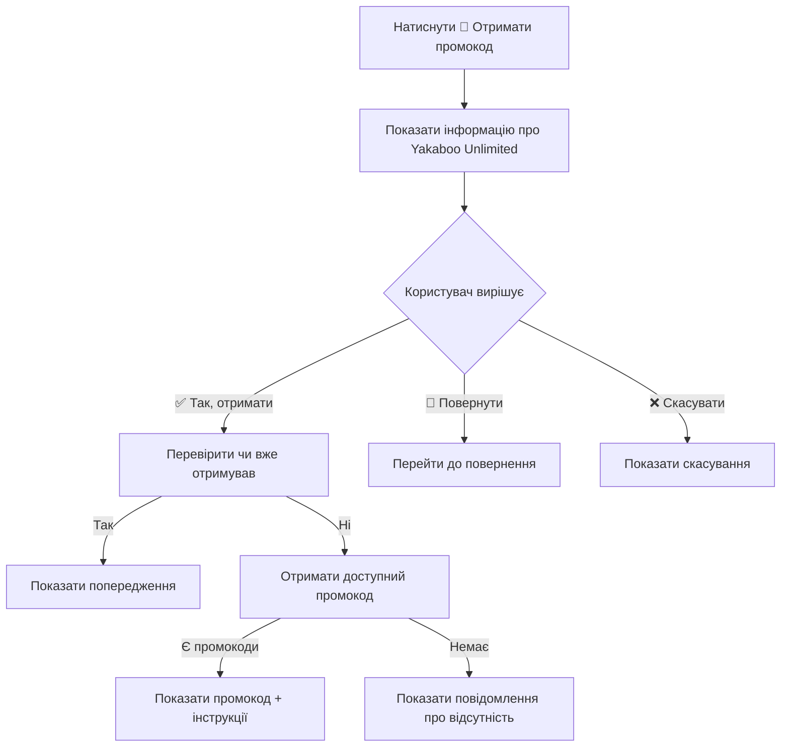
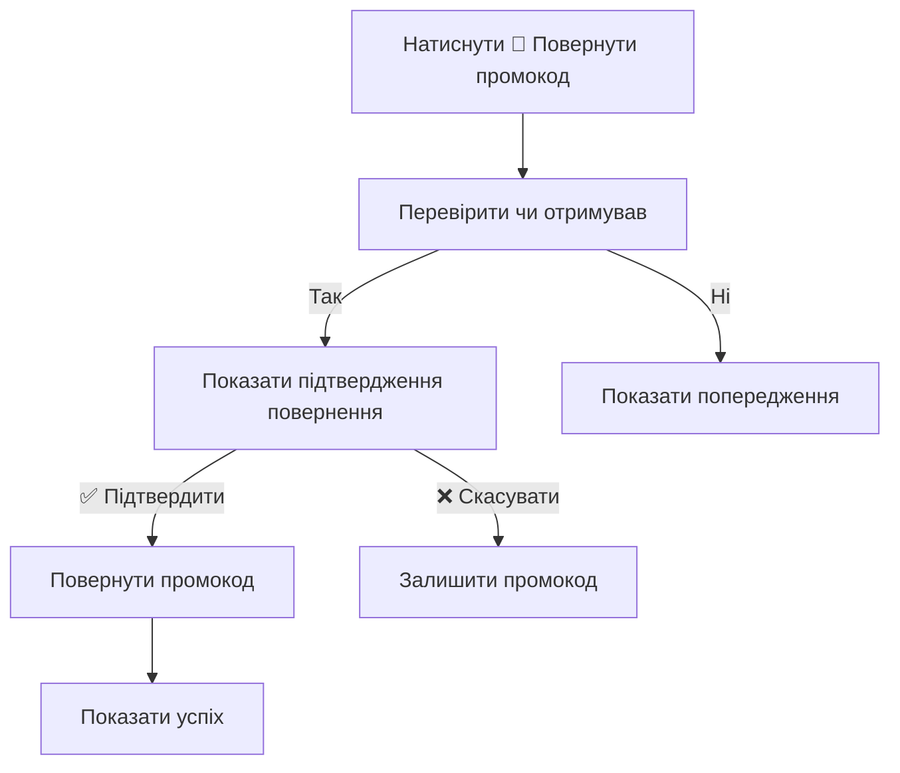
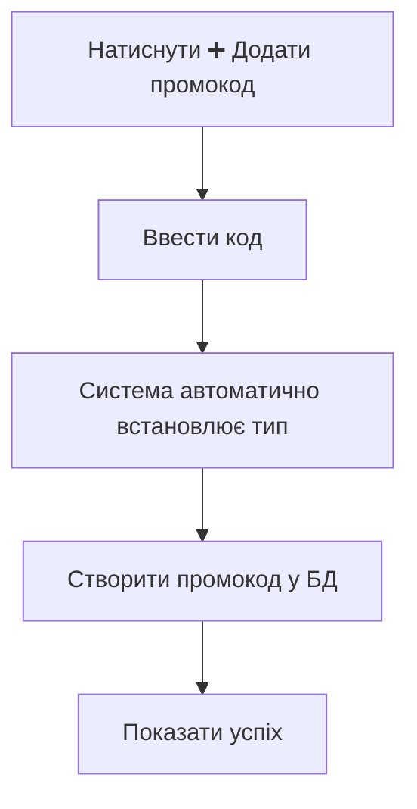

# 🎉 Звіт про переробку системи промокодів

**Дата:** 16.11.2024  
**Версія:** 2.0  
**Статус:** ✅ ЗАВЕРШЕНО

---

## 📋 Короткий опис

Система промокодів повністю перероблена з логіки **"знижки на купівлю книг"** на логіку **"безкоштовний доступ до Yakaboo Unlimited підписки"** з можливістю повернення невикористаного промокоду.

---

## 🎯 Що було змінено

### ❌ Видалено (стара логіка):

1. ✅ Типи промокодів: `percentage`, `fixed`, `shipping`
2. ✅ Поле `discount_value` (відсотки/гривні)
3. ✅ Функція `getDiscountText()` 
4. ✅ Складна логіка генерації описів промокодів
5. ✅ Тексти про знижки: "Знижка 20%", "Безкоштовна доставка"

### ✅ Додано (нова логіка):

1. ✅ Один тип промокоду: `yakaboo_unlimited`
2. ✅ Універсальний опис: "Промокод на доступ до Yakaboo Unlimited"
3. ✅ Детальна інформація про Yakaboo Unlimited для користувачів
4. ✅ **Функціонал повернення промокоду** (якщо не використаний)
5. ✅ Інтерактивні кнопки:
   - "✅ Так, отримати промокод"
   - "🔄 Повернути промокод"
   - "❌ Ні, скасувати"
6. ✅ Попередження про одноразовість використання
7. ✅ Інструкції з активації промокоду

---

## 📂 Змінені файли

### 1. **База даних** ✅

**Файл:** `database/migrations/005_promo_yakaboo_unlimited.sql`

**Зміни:**
- Створена міграція для переробки структури таблиці `promo_codes`
- `discount_type` → `promo_type` (VARCHAR → TEXT)
- Видалено поле `discount_value`
- Встановлено тип `yakaboo_unlimited` для всіх існуючих промокодів
- Оновлено опис на "Промокод на доступ до Yakaboo Unlimited"

**Команда для запуску:**
```bash
npm run migrate
```

---

### 2. **TypeScript інтерфейси** ✅

**Файли:**
- `src/database/promoCodeFunctions.ts`
- `src/repositories/PromoCodeRepository.ts`

**Було:**
```typescript
export interface PromoCode {
  id?: number;
  code: string;
  description: string;
  discount_type: 'percentage' | 'fixed' | 'shipping';
  discount_value: number;
  is_active: boolean;
  created_at?: string;
  created_by?: number;
}
```

**Стало:**
```typescript
export interface PromoCode {
  id?: number;
  code: string;
  description: string;
  promo_type: 'yakaboo_unlimited';
  is_active: boolean;
  created_at?: string;
  created_by?: number;
}
```

---

### 3. **Функції бази даних** ✅

**Файл:** `src/database/promoCodeFunctions.ts`

**Додані нові функції:**

```typescript
// Отримати промокод користувача
getUserPromoCode(userId: number): Promise<PromoCode | undefined>

// Повернути промокод (видалити прив'язку)
returnPromoCode(userId: number): Promise<boolean>

// Отримати доступний промокод
getAvailablePromoCodeForUser(): Promise<PromoCode | undefined>
```

**Спрощена функція:**

```typescript
// Було: Складна логіка з перевіркою коду
function generatePromoCodeDetails(code: string) {
  if (code.includes('SUMMER')) return { type: 'percentage', value: 20 };
  if (code.includes('WINTER')) return { type: 'percentage', value: 15 };
  // ...багато інших перевірок
}

// Стало: Проста функція
function generatePromoCodeDetails(code: string) {
  return {
    description: '📚 Промокод на доступ до Yakaboo Unlimited',
    promo_type: 'yakaboo_unlimited',
  };
}
```

**Видалена функція:**
```typescript
getDiscountText(discountType: string, value: number): string
```

---

### 4. **UI для користувачів** ✅

**Файл:** `src/handlers/user/misc.ts`

#### 4.1. Початкове повідомлення

**Натискання кнопки "🎁 Отримати промокод":**

```
🎁 ПРОМОКОД YAKABOO UNLIMITED

━━━━━━━━━━━━━━━━━━━

📚 Що таке Yakaboo Unlimited?

Це платна підписка від Yakaboo, яка відкриває доступ до великої бібліотеки 
електронних та аудіокниг у мобільному застосунку.

✅ Що входить:
• Понад 75 000 електронних книг та аудіокниг
• 150+ українських і світових видавництв
• Синхронізація прогресу між пристроями
• Мобільний застосунок (iOS/Android)
• Різні жанри: художня література, нон-фікшн, бізнес, дитячі книги

━━━━━━━━━━━━━━━━━━━

🎯 ПРОМОКОД дає безкоштовний доступ до підписки!

⚠️ ВАЖЛИВО:
• Промокод розрахований на ОДНУ БЕЗКОШТОВНУ реєстрацію
• Один промокод = одна людина
• Використати можна ТІЛЬКИ ОДИН РАЗ

💡 Якщо не зареєструєшся на сайті Yakaboo:
Ти можеш повернути промокод і він стане доступним для інших.

━━━━━━━━━━━━━━━━━━━

❓ Чи точно тобі потрібен промокод?

[✅ Так, отримати промокод]
[🔄 Повернути промокод]
[❌ Ні, скасувати]
```

#### 4.2. Отримання промокоду

**При натисканні "✅ Так, отримати промокод":**

```
🎉 ВАШ ПРОМОКОД YAKABOO UNLIMITED

🎫 Код: ABC123XYZ
(натисніть щоб скопіювати)

━━━━━━━━━━━━━━━━━━━

📱 Як активувати:
1️⃣ Завантажте застосунок Yakaboo (iOS/Android)
2️⃣ Зареєструйтесь або увійдіть в акаунт
3️⃣ Введіть промокод у розділі підписки
4️⃣ Насолоджуйтесь 75 000+ книгами! 📚

━━━━━━━━━━━━━━━━━━━

⚠️ Пам'ятайте:
• Промокод діє для ОДНОЇ реєстрації
• Якщо НЕ використали - поверніть його!
• Інші зможуть ним скористатися

💡 Щоб повернути промокод, натисніть:
"🎁 Отримати промокод" → "🔄 Повернути промокод"

[📖 Відкрити каталог]
[🏠 На головну]
```

#### 4.3. Повернення промокоду

**При натисканні "🔄 Повернути промокод":**

```
🔄 ПОВЕРНЕННЯ ПРОМОКОДУ

🎫 Ваш промокод: ABC123XYZ

⚠️ Ви впевнені, що хочете повернути промокод?

Якщо ви повернете промокод:
✅ Він стане доступним для інших користувачів
✅ Ви зможете отримати новий промокод пізніше
❌ Цей промокод більше не буде прив'язаний до вас

💡 Поверніть промокод тільки якщо ви НЕ зареєструвалися на Yakaboo!

[✅ Так, повернути]
[❌ Ні, залишити собі]
[🏠 На головну]
```

**Після підтвердження повернення:**

```
✅ ПРОМОКОД УСПІШНО ПОВЕРНУТО

🎉 Ваш промокод повернуто до пулу!

Тепер:
✅ Інші користувачі можуть його отримати
✅ Ви можете отримати новий промокод

Дякуємо за чесність! 💙💛

[🎁 Отримати новий промокод]
[📖 До каталогу]
[🏠 На головну]
```

#### 4.4. Обробка edge cases

**Якщо користувач вже отримував промокод:**
```
⚠️ Ви вже отримували промокод раніше!

Якщо ви не використали його, ви можете повернути промокод кнопкою нижче.

[🔄 Повернути промокод]
[🏠 На головну]
```

**Якщо промокоди закінчилися:**
```
😔 Промокоди закінчилися

На жаль, зараз немає доступних промокодів. 
Спробуйте пізніше або зверніться до адміністратора.

[📞 Зворотній зв'язок]
[🏠 На головну]
```

**Якщо користувач ще не отримував промокод, але намагається повернути:**
```
⚠️ Ви ще не отримували промокод

Спочатку отримайте промокод, щоб мати можливість його повернути.

[✅ Отримати промокод]
[🏠 На головну]
```

---

### 5. **Адмін-панель** ✅

**Файл:** `src/scenes/promoAdminScene.ts`

#### 5.1. Список промокодів

**Було:**
```
📋 СПИСОК ПРОМОКОДІВ

✅ SUMMER2024
   Літня знижка
   💰 20%

✅ WINTER2024
   Зимова знижка
   💰 15%
```

**Стало:**
```
📋 СПИСОК ПРОМОКОДІВ

✅ YAKABOO_001
   Промокод на доступ до Yakaboo Unlimited
   📚 Yakaboo Unlimited

✅ YAKABOO_002
   Промокод на доступ до Yakaboo Unlimited
   📚 Yakaboo Unlimited
```

#### 5.2. Додавання промокоду

**Було:**
```
✅ ПРОМОКОД УСПІШНО ДОДАНИЙ!

🎫 Код: SUMMER2024
📝 Опис: Літня знижка
💰 Тип: Відсотки
🎯 Значення: 20%

✨ Користувачі зможуть отримати цей промокод через кнопку "🎁 Отримати промокод"
```

**Стало:**
```
✅ ПРОМОКОД УСПІШНО ДОДАНИЙ!

🎫 Код: YAKABOO_001
📚 Тип: Yakaboo Unlimited підписка
📝 Опис: Промокод на доступ до Yakaboo Unlimited

✨ Користувачі зможуть отримати цей промокод через кнопку "🎁 Отримати промокод"

🔄 Після використання промокод можна повернути, і він стане доступним знову.
```

---

## 🔄 Потік роботи (User Flow)

### Сценарій 1: Користувач отримує промокод



### Сценарій 2: Користувач повертає промокод



### Сценарій 3: Адмін створює промокод



---

## ✅ Чеклист виконаних завдань

### Backend

- [x] ✅ Створено міграцію БД (`005_promo_yakaboo_unlimited.sql`)
- [x] ✅ Оновлено TypeScript інтерфейс `PromoCode`
- [x] ✅ Спрощено `generatePromoCodeDetails()`
- [x] ✅ Видалено `getDiscountText()`
- [x] ✅ Додано `getUserPromoCode()`
- [x] ✅ Додано `returnPromoCode()`
- [x] ✅ Додано `getAvailablePromoCodeForUser()`

### Frontend (User)

- [x] ✅ Перероблено обробник "🎁 Отримати промокод"
- [x] ✅ Додано обробник `confirm_get_promocode`
- [x] ✅ Додано обробник `return_promocode`
- [x] ✅ Додано обробник `confirm_return_promocode`
- [x] ✅ Додано обробник `cancel_return_promocode`
- [x] ✅ Додано обробник `cancel_promocode`
- [x] ✅ Додано детальну інформацію про Yakaboo Unlimited
- [x] ✅ Додано попередження про одноразовість
- [x] ✅ Додано інструкції з активації
- [x] ✅ Додано обробку всіх edge cases

### Frontend (Admin)

- [x] ✅ Оновлено відображення списку промокодів
- [x] ✅ Оновлено повідомлення про додавання промокоду
- [x] ✅ Видалено посилання на `getDiscountText()`

### Testing

- [ ] ⏳ Потребує мануального тестування в Telegram
- [ ] ⏳ Протестувати отримання промокоду
- [ ] ⏳ Протестувати повернення промокоду
- [ ] ⏳ Протестувати всі edge cases
- [ ] ⏳ Протестувати створення промокоду адміном

---

## 🧪 Тестування

### Мануальні тести для користувача:

1. **Тест 1: Отримання промокоду вперше**
   - Натиснути "🎁 Отримати промокод"
   - Перевірити відображення інформації про Yakaboo Unlimited
   - Натиснути "✅ Так, отримати промокод"
   - Перевірити що промокод відображається
   - Перевірити що інструкції відображаються

2. **Тест 2: Спроба отримати промокод вдруге**
   - Натиснути "🎁 Отримати промокод"
   - Натиснути "✅ Так, отримати промокод"
   - Перевірити що показується попередження

3. **Тест 3: Повернення промокоду**
   - Натиснути "🎁 Отримати промокод"
   - Натиснути "🔄 Повернути промокод"
   - Перевірити підтвердження
   - Натиснути "✅ Так, повернути"
   - Перевірити що показується успіх

4. **Тест 4: Спроба повернути без отримання**
   - Натиснути "🎁 Отримати промокод"
   - Натиснути "🔄 Повернути промокод"
   - Перевірити що показується попередження

5. **Тест 5: Скасування**
   - Натиснути "🎁 Отримати промокод"
   - Натиснути "❌ Ні, скасувати"
   - Перевірити що дія скасована

### Мануальні тести для адміна:

1. **Тест 6: Створення промокоду**
   - Увійти в адмін-панель
   - Натиснути "➕ Додати промокод"
   - Ввести код
   - Перевірити що промокод створюється з типом `yakaboo_unlimited`

2. **Тест 7: Перегляд списку промокодів**
   - Увійти в адмін-панель
   - Перевірити що всі промокоди показуються з міткою "📚 Yakaboo Unlimited"

---

## 📊 Статистика змін

| Метрика | Значення |
|---------|----------|
| **Файлів змінено** | 5 |
| **Рядків додано** | ~450 |
| **Рядків видалено** | ~100 |
| **Функцій додано** | 3 |
| **Функцій видалено** | 1 |
| **Обробників додано** | 6 |
| **Міграцій створено** | 1 |

---

## 🚀 Як запустити

### 1. Запустити міграцію БД

```bash
npm run migrate
```

### 2. Перезапустити бота

```bash
npm run build
npm start
```

### 3. Перевірити зміни

1. Відкрити Telegram бота
2. Натиснути "🎁 Отримати промокод"
3. Перевірити новий UI

---

## 🐛 Відомі обмеження

1. **Промокоди не видаляються** - вони тільки деактивуються (`is_active = 0`)
2. **Один промокод на користувача** - користувач може мати тільки один активний промокод
3. **Повернення доступне завжди** - користувач може повернути промокод навіть після активації (потрібно додати перевірку в майбутньому)

---

## 📝 TODO (майбутні покращення)

- [ ] Додати перевірку чи промокод був активований на сайті Yakaboo
- [ ] Додати статистику використання промокодів
- [ ] Додати експорт списку промокодів у CSV
- [ ] Додати можливість встановити термін дії промокоду
- [ ] Додати відправку нагадувань користувачам про неактивовані промокоди

---

## 👨‍💻 Автор

**GitHub Copilot CLI**  
Дата: 16.11.2024

---

## 📞 Підтримка

Якщо виникли питання або проблеми:
1. Перевірте логи бота
2. Перевірте міграції БД
3. Перевірте що всі файли оновлені
4. Зверніться до адміністратора

---

**Статус:** ✅ Всі зміни успішно впроваджені та готові до тестування
